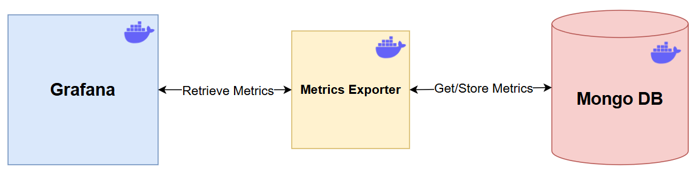

# Grafana Experiments

## Overview

This project is dedicated to experimenting with Grafana, a powerful open-source platform for monitoring and observability. The repository includes configurations and scripts to set up a Grafana environment using Docker and Python.

## Features

- **Dockerized Setup**: Utilize Docker and Docker Compose for easy environment setup.
- **Python Integration**: Includes a Python script (`web_server.py`) to simulate or collect metrics.
- **Custom Metrics**: Define and visualize custom metrics using `metrics.json`.

## Prerequisites

Ensure you have the following installed:

- [Docker](https://www.docker.com/get-started)
- [Docker Compose](https://docs.docker.com/compose/install/)
- [Python 3.x](https://www.python.org/downloads/)

## System architecture
This demo consists of three Docker containers, as illustrated in the following diagram:



- **Grafana**: a visualization tool used to display metrics. This container interacts with a web server to retrieve and present data in graphical form.
  - The [Infinity](https://grafana.com/grafana/plugins/yesoreyeram-infinity-datasource/) plugin is used for interacting with REST API.
  - The [Business Charts](https://grafana.com/grafana/plugins/volkovlabs-echarts-panel/) plugin is used for rendering non-real-time graphs.
- **Metrics Exporter**: a lightweight service that exposes endpoints for Grafana to fetch metrics.
- **Mongo DB**: a database used to store metrics. In this demo, MongoDB is included primarily to introduce latency and simulate real-world conditions.

## Setup Instructions

1. **Clone the Repository**:
   
   ```bash
   git clone https://github.com/Giuscar/grafana-experiments.git
   cd grafana-experiments

2. **Build and Start the Docker Containers**:

    ```docker
   docker-compose start --build
    ```
    This command will build and start the services defined in the docker-compose.yaml


3. **Access Grafana**
   
   Once the containers are running, navigate to the following URL in your browser to access the Grafana dashboard:
   http://127.0.0.1:3000
   The default Grafana credentials are:
   
   **Username**: admin 

   **Password**: admin (You’ll be prompted to change this upon first login)


4. **Explore the dashboards**
- Example Grafana Dashboard: below is an example of a Grafana dashboard visualized using the Infinity and Business Chart plugins.


- Dynamic Filter Application: the dashboard supports dynamic adaptation based on the hw_type_keys filter. This allows you to adjust the view of the metrics based on the selected filter.


